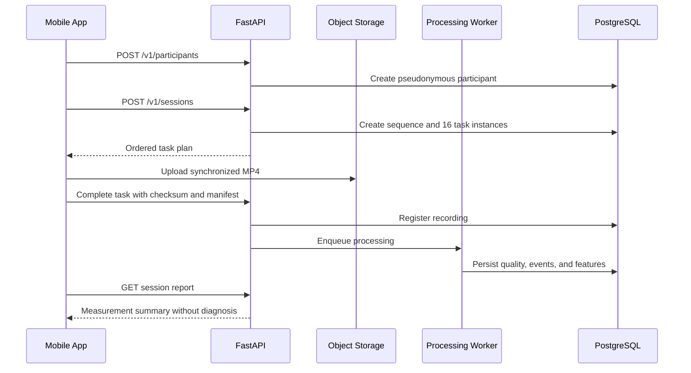

# API workflow

```mermaid
sequenceDiagram
    participant App as Mobile App
    participant API as FastAPI
    participant Store as Object Storage
    participant Worker as Processing Worker
    participant DB as PostgreSQL

    App->>API: POST /v1/participants
    API->>DB: Create pseudonymous participant
    App->>API: POST /v1/sessions
    API->>DB: Create sequence and 16 task instances
    API-->>App: Ordered task plan
    App->>Store: Upload synchronized MP4
    App->>API: Complete task with checksum and manifest
    API->>DB: Register recording
    API->>Worker: Enqueue processing
    Worker->>DB: Persist quality, events, and features
    App->>API: GET session report
    API-->>App: Measurement summary without diagnosis
```
