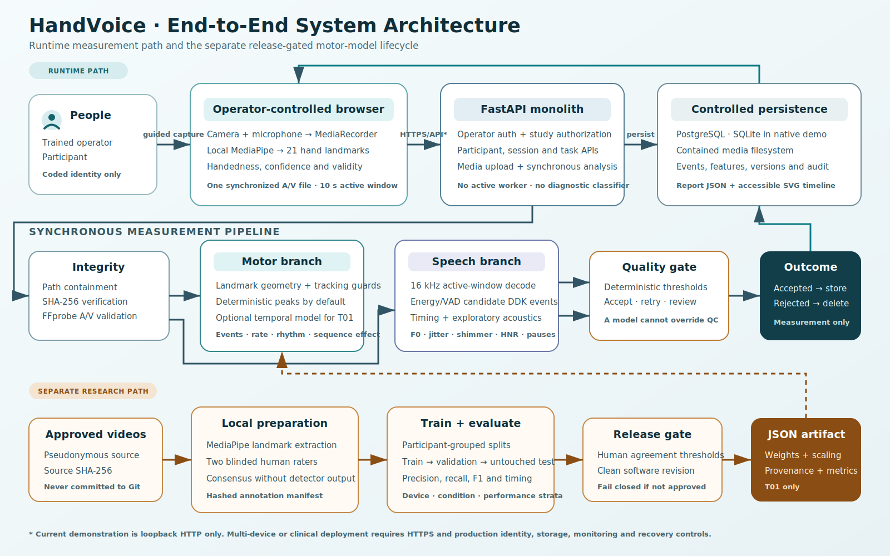
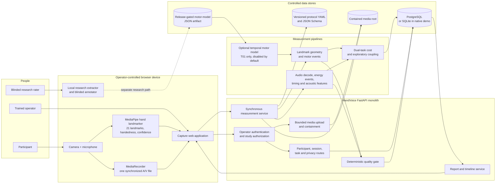
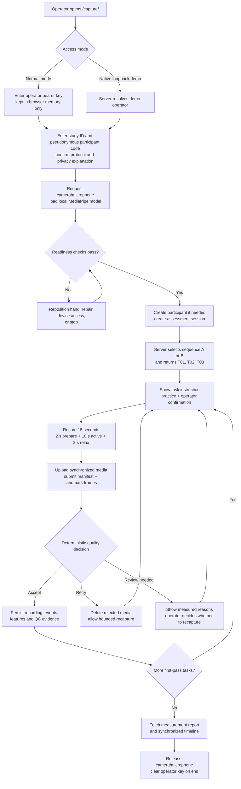
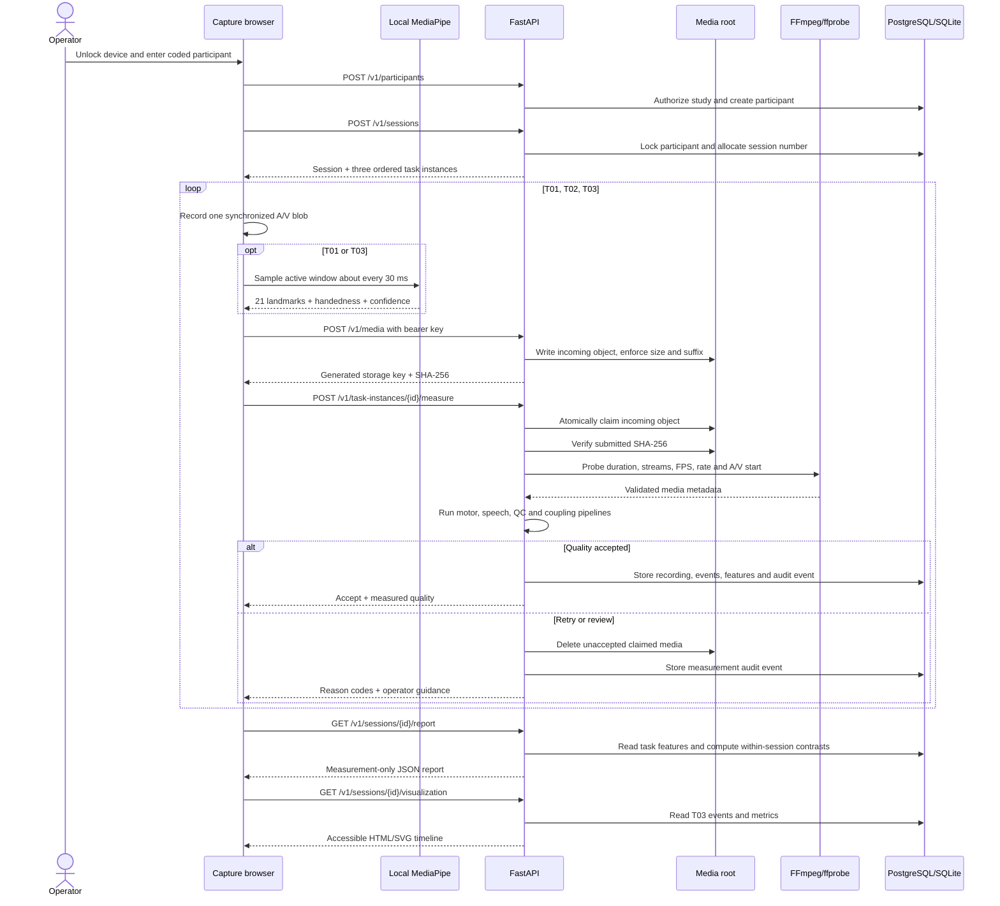
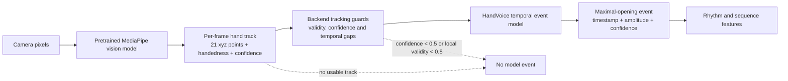
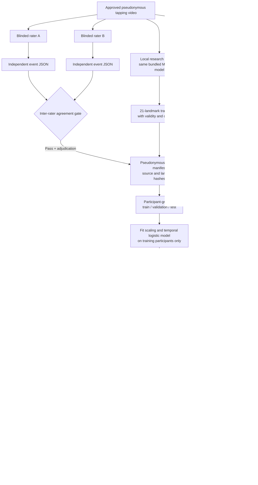
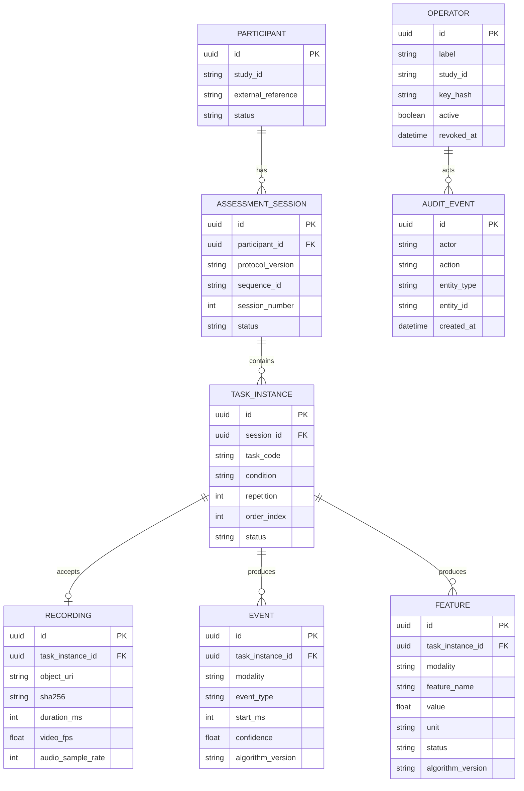
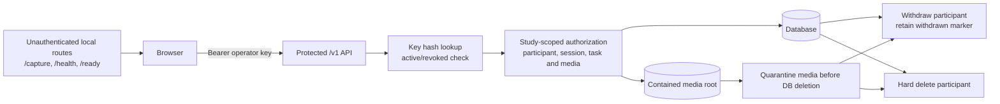
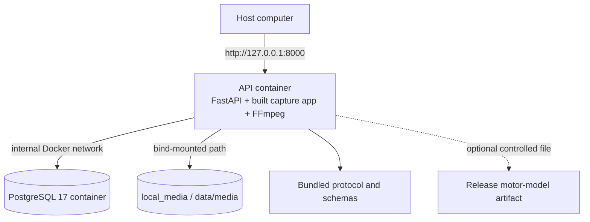

# HandVoice System Architecture

**Version:** 2026-07-23

**Scope:** Executable competition MVP plus the guarded motor-model lifecycle

**Architecture style:** Browser capture client + synchronous FastAPI monolith +
relational database + contained media storage



## 1. Architecture verdict

HandVoice currently measures a fixed three-task hand/speech protocol. Computer
vision runs in the browser, while media validation, signal processing, quality
decisions, persistence and reporting run synchronously in the API. The optional
motor-event model interprets the browser-produced landmark time series; it does
not replace hand detection or tracking.

There is no active background worker, cloud inference service, disease
classifier, MDS-UPDRS predictor or treatment recommendation component.

## 2. End-to-end system context



## 3. User journey and application states



### Frozen first-pass tasks

| Code | Condition | Captured signals | Primary outputs |
|---|---|---|---|
| `T01` | Right-hand tapping alone | A/V + right-hand landmarks | Tap events, rate, rhythm, amplitude and sequence-effect features |
| `T02` | `/pa-ta-ka/` alone | A/V; no hand landmarks required | Candidate DDK events, timing and exploratory acoustic features |
| `T03` | Simultaneous tapping + `/pa-ta-ka/` | A/V + right-hand landmarks | Motor/speech events, dual-task contrasts and exploratory coupling |

Sequence `A` is `T01 → T02 → T03`; sequence `B` is
`T02 → T01 → T03`. An optional second recording is created only after an
accepted first recording.

## 4. Runtime request and data sequence



## 5. Synchronous measurement pipeline

```mermaid
flowchart TD
    Request["MeasurementSubmission JSON"] --> Contract["Pydantic contract validation<br/>task-specific payload rules"]
    Contract --> Claim["Atomically move media<br/>incoming → processing"]
    Claim --> Integrity["Path containment + operator ownership<br/>SHA-256 + ffprobe validation"]

    Integrity --> Frames
    Integrity --> Decode

    subgraph VideoBranch["Motor branch: T01 and T03"]
        Frames["Timestamped landmark frames"] --> Confidence["Reject invalid, out-of-guide<br/>and confidence < 0.5 frames"]
        Confidence --> Geometry["Thumb-index distance and angle<br/>normalized by palm scale"]
        Geometry --> Detector{"Task and model setting"}
        Detector -->|"T01 + approved model enabled"| ML["Temporal logistic model<br/>tracking-quality-aware"]
        Detector -->|"T01 model disabled or T03"| Peaks["Deterministic peak detector"]
        ML --> MotorEvents["Tap timestamps, amplitudes<br/>and confidence"]
        Peaks --> MotorEvents
        MotorEvents --> MotorFeatures["Rate, interval CV, median amplitude,<br/>decrement and halt features"]
    end

    subgraph AudioBranch["Speech branch: T02 and T03"]
        Decode["Decode 10-second active window<br/>to 16 kHz PCM"] --> AudioQC["SNR, clipping and speech-presence QC"]
        Decode --> Energy["Energy/VAD candidate events<br/>when annotations are absent"]
        Energy --> SpeechEvents["Candidate DDK onsets<br/>and voiced intervals"]
        SpeechEvents --> SpeechFeatures["Rate, interval CV, dwell,<br/>pause and cadence features"]
        Decode --> Acoustic["Exploratory autocorrelation features<br/>F0, jitter, shimmer and HNR"]
    end

    MotorEvents --> Sync["Maximum-cardinality,<br/>minimum-total-lag event matching"]
    SpeechEvents --> Sync
    Sync --> Coupling["Exploratory event coincidence"]

    Integrity --> QC
    MotorFeatures --> QC["Deterministic capture-quality gate"]
    AudioQC --> QC
    QC --> Outcome{"Accept, retry,<br/>or review needed"}
    Outcome -->|"Accept"| Persist["Persist recording, events,<br/>features, versions and QC"]
    Outcome -->|"Retry/review"| Delete["Delete unaccepted media<br/>task remains incomplete"]
```



### Quality gate inputs

The model cannot override these thresholds or decisions.

| Area | Measurements used by the authoritative gate |
|---|---|
| Video | Achieved FPS, valid-frame fraction, out-of-guide fraction and wrong-hand fraction; wrong-hand frames are controlled by this gate |
| Audio | SNR, clipping fraction, speech detected and decode success |
| Synchronization | Audio/video start offset and usable active-window coverage |
| Task sufficiency | Motor-event and DDK-event counts |
| Capture lifecycle | Screen hidden, lock or explicit interruption |

## 6. Motor model and computer-vision relationship



The temporal model never receives raw pixels. MediaPipe performs visual
perception; the HandVoice model learns event timing from the tracked motion.
This reduces data requirements and makes tracking failure visible instead of
allowing an end-to-end video network to hide it.

### Runtime model selection

| Situation | Detector used |
|---|---|
| Current demo | Deterministic motor peak detector |
| T01 with a release-gated artifact enabled | Temporal motor model |
| T03 dual task | Deterministic detector until dual-task training data exist |
| Enabled model missing, malformed or not release-approved | API startup fails |

## 7. Separate research and model-release lifecycle

This path is deliberately separated from participant runtime.



The release gate requires blinded human annotations, participant-disjoint
splits, at least 20 untouched test recordings, device/condition/performance
coverage, precision/recall/F1 of at least 0.90 and timing MAE no greater than
50 ms. Passing this gate establishes event-detector agreement only, not
diagnosis or clinical utility.

## 8. Persistence model



Important constraints:

- one unique session number per participant;
- one task code/repetition pair per session;
- one accepted recording per task instance;
- participant deletion cascades through sessions, tasks, events and features;
- raw media is stored in the controlled filesystem, not inside the database;
- audit events intentionally avoid raw media, landmarks and clinical claims.

## 9. Runtime data formats

| Data | Format | Producer → consumer | Persistence |
|---|---|---|---|
| Operator credential | Bearer token | Operator → API authentication | Raw key remains in browser memory; only SHA-256 hash is stored |
| Participant identity | Pseudonymous study/reference IDs | Operator → participant API | Relational database |
| Session/task plan | JSON | Session API → browser | Relational database |
| Raw capture | MP4, WebM or MOV | MediaRecorder → media API | Contained media root after acceptance |
| Landmark frame | JSON: timestamp, handedness, exactly 21 xyz points, confidence, validity | Local MediaPipe → measurement API | Derived events/features are stored; raw submitted frame list is not stored as its own table |
| Capture manifest | JSON | Browser → measurement API | `task_instances.manifest_json` after acceptance |
| Motor model | Non-executable JSON parameters + provenance + validation report | Offline trainer → API startup loader | Controlled release path, not database |
| Events | Relational rows with timestamp, confidence, metadata and algorithm version | Measurement pipeline → report | Database |
| Features | Relational rows with value, unit, status, metadata and algorithm version | Measurement pipeline → report | Database |
| Report | JSON + generated HTML/SVG | API → browser | Recomputed from stored events/features |

## 10. Authentication, authorization and privacy boundaries



Current trust boundaries:

1. The participant does not enter or receive an operator key.
2. Normal `/v1` requests fail closed without an active key.
3. Native demo bypass works only for a loopback request in the explicit
   `native-demo` environment.
4. Study-scoped operators cannot access another study's participants, sessions,
   tasks or pending uploads.
5. Upload names are generated by the API and bound to the operator ID.
6. Media paths are contained under one configured root and verified by hash.
7. Rejected media is deleted; withdrawal/deletion quarantines media before the
   database transaction commits.

## 11. Deployment layout

### Docker demo



- Only the API is published, and only to loopback.
- PostgreSQL is not published to the host.
- Alembic migrations run before API startup.
- Measurement is synchronous inside the API process.
- The archived worker module exits intentionally and is not deployed.

### Native demo

```text
Browser on loopback
  -> Uvicorn/FastAPI process
  -> local SQLite database
  -> local contained media directory
  -> host FFmpeg/ffprobe
```

Native demo authentication bypass is a loopback-only convenience and must not
be used as a production security model.

## 12. Source-code layout

```text
apps/capture-web/                 Browser workflow, MediaPipe and recording
configs/protocol.v1.yaml          Frozen task timing, sequence and QC defaults
packages/protocol_schema/         Protocol JSON Schema
services/api/app/routers/         HTTP endpoints
services/api/app/services/        AuthZ, sessions, media, measurement, privacy
services/api/app/models/          Relational persistence entities
pipelines/video/                  Landmark geometry and motor model
pipelines/audio/                  Audio events, timing and acoustic features
pipelines/quality/                Deterministic acceptance gate
pipelines/coupling/               Cross-modal event matching
pipelines/dual_task/              Direction-aware dual-task costs
pipelines/validation/             Frozen agreement and release thresholds
scripts/train_motor_event_model.py Offline motor-model training entry point
validation/schemas/               Human annotation/training contracts
migrations/                       Versioned relational schema changes
infrastructure/docker/            Reproducible application image
```

## 13. What the architecture currently does not contain

- no Parkinson's disease probability or diagnostic decision;
- no MDS-UPDRS score prediction;
- no automatic clinical recommendation;
- no participant self-service or home administration;
- no cloud object storage, presigned uploads or clinical IAM;
- no asynchronous job queue or active worker;
- no raw-pixel HandVoice neural network;
- no release-enabled human-trained motor artifact yet;
- no validated dual-task motor model for `T03`;
- no production monitoring, alerting or tested disaster recovery.

## 14. Next architecture gates

1. Complete blinded motor annotation and train the first development artifact.
2. Evaluate untouched participants across the required device, condition and
   performance strata.
3. Add an independent expected-artifact hash or signed-model manifest before
   production model promotion.
4. Store a versioned inference trace containing model, protocol and pipeline
   versions for every accepted recording.
5. Move media to encrypted managed object storage and replace local bearer-key
   provisioning before any multi-site or real-clinical deployment.
6. Add production observability, backup/restore and a tested rollback path.
7. Run human factors, privacy, security and clinical-statistical review before
   expanding the claim boundary.
