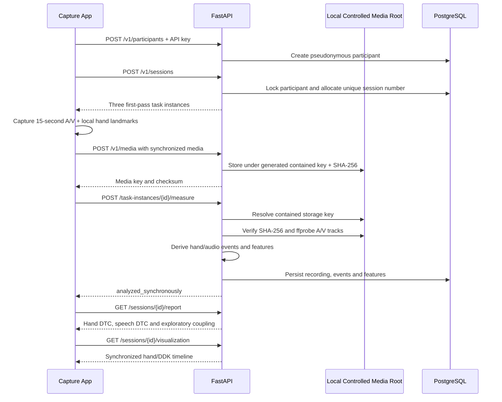

# Executable API workflow

## Repeat rule

`POST /v1/task-instances/{id}/repeat` creates repetition 2 only when repetition 1 is already accepted. The initial session never creates six recordings automatically.

## Security boundary

The validation prototype uses one configured API key, bounded uploads, generated storage keys and a contained local media root. It is not a multi-tenant production authorization model.
