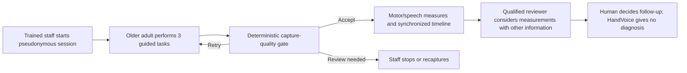

# Proposed care flow and human governance

## Authority boundary

- The software may accept, reject or flag recording quality using versioned rules.
- It may calculate measurements and display limitations.
- It may not diagnose, triage, recommend treatment, alter thresholds or override a human.
- A future language model may rephrase an already-decided retry instruction only
  after it beats fixed templates on a golden evaluation set.

**Workflow validation status:** OPEN — confirm operator, reviewer and downstream
action through `problem-validation.md` before submission.
